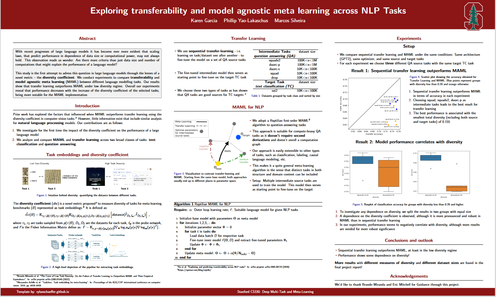

# Exploring transferability and model agnostic meta learning across NLP Tasks

Code for the project "Exploring transferability and model agnostic meta learning across NLP Tasks". CS330 Deep Multi-Task and Meta Learning, Stanford University.



## Task embeddings and diversity coefficient

The diversity coefficient is a novel metric proposed to measure diversity of tasks for meta-learning benchmarks. It measures the expectation of the distance between tasks. In order to represent tasks we use Task2Vec embeddings, which are defined as the diagonal entries of the Fisher Information Matrix when a fixed probe neural network is used as feature extractor after a model is fine-tuned to the given task.
To compute the embeddings, you can use the jupyter notebook ComputeTaskEmbedding.ipynb and to get source and target diversity use the script TaskDiversity.py.


## Fine-tuning GPT2 on downstream NLP tasks

For each (intermediate question answering tasks, text classification target task) group, we use a pretrained GPT2 model, fine-tune it sequentally on the intermediate tasks, and then fine-tune the resulting model on the text classification target task. We have separate code for fine-tuning GPT2 on each class of problems, including the intermediate task question answering and the target task text classification/regression. 

The following example code fine-tunes GPT2 on the datasets squad, squadv2, duorc-p as intermediate tasks. The fine-tuned intermediate model then serves as
starting point to fine-tune on the target text classification task:

``` 
!python run_intermediate_source_GPT2.py --dataset_name 'squad' --output_dir './pretrained_model_squad'
!python run_intermediate_source_GPT2.py --dataset_name 'squad_v2' --model_name './pretrained_model_squad'  --output_dir './pretrained_model_squad_v2'
!python run_intermediate_source_GPT2.py --dataset_name 'duorc-p' --model_name './pretrained_model_squad_v2'  --output_dir './pretrained_model_duorc-p'
!python run_target_task_GPT2_sst2_multiple.py --pretrained_model './pretrained_model_duorc-p'
```

## Model Agnostic Meta Learning (MAML)

We adopt a Reptilian first-order MAML algorithm to question-answering tasks. This approach is suitable for compute-heavy QA
tasks as it doesn’t require second derivatives and doesn’t unroll a computation graph. 

In this example we use multiple intermediate source tasks squad, squad_v2 and subset SelfRC from duorc to train the MAML model:
``` 
!python maml_qa.py --tasks 'squad,squad_v2,duorc;SelfRC'
```
